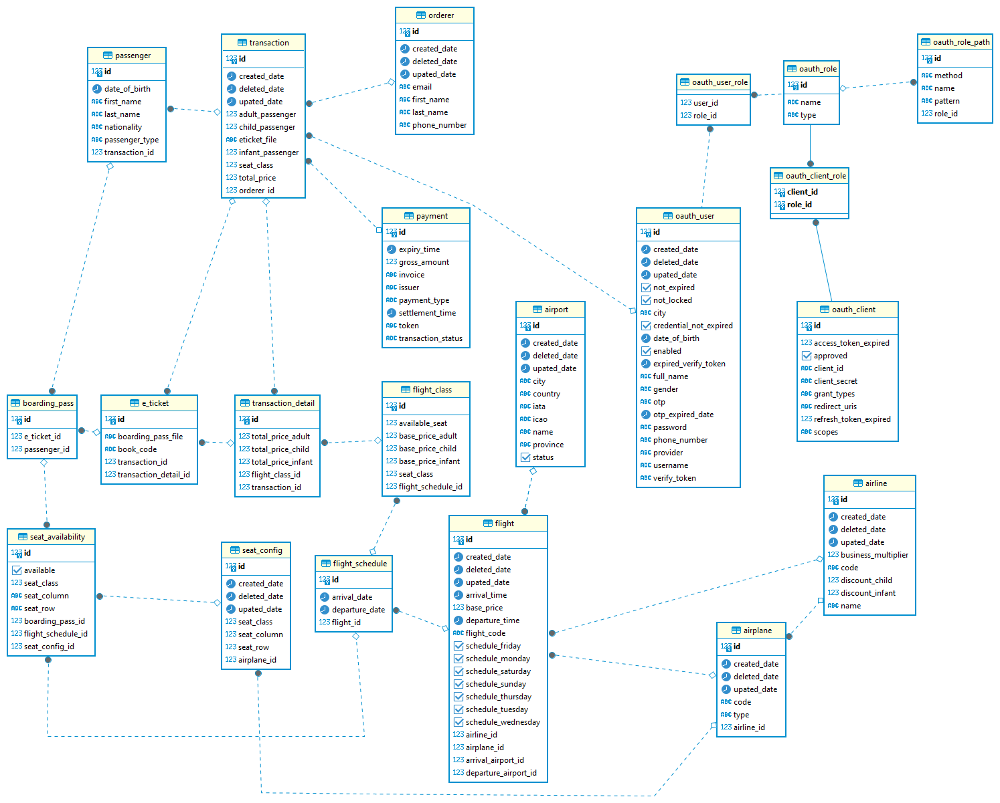

# Ticket Booking Application

This repository contains the server-side code for a ticket booking application. The application enhances efficiency, convenience, and real-time payment by simplifying the ticket purchasing process through a streamlined booking interface and improved booking efficiency.

- **Repository**: [https://github.com/WeFly-Team/Backend-Java](https://github.com/WeFly-Team/Backend-Java)
- **API Documentation on Postman**: [https://documenter.getpostman.com/view/30534452/2s9YsJDYXZ](https://documenter.getpostman.com/view/30534452/2s9YsJDYXZ)

## Features

- **Self Check-in**: Allows users to check in through the app.
- **Efficient Ordering Flow**: Implements a payment gateway using Midtrans to simulate user payments and automatically expire payments using Quartz if the payment method is not selected within a specific period.
- **User Authentication and Authorization**: Includes OAuth using Google.
- **Admin Features**: Allows monitoring of flight ticket bookings, income, and other relevant data.
- **Flight Ticket Pagination and Filtering**: Provides easy navigation and search options for flight tickets.
- **E-Ticket and Payment Proof Generation**: Generates e-tickets and payment proofs, which are sent to the user's email and can be downloaded from the app.
- **Flight Ticket Generation and Scheduling**: Mimics real flight schedules and ticket generation.

## Tech Stack

**Backend:**
- **Spring Boot**: Java-based framework for building web applications
- **Maven**: Dependency management and build tool
- **PostgreSQL**: Relational database for data storage
- **Quartz Scheduler**: Scheduler for handling automatic payment expiration
- **DigitalOcean**: Cloud platform for deploying applications
- **Midtrans**: Payment gateway for simulating user payments
- **iText**: Library for generating PDF documents

## Getting Started

Follow these steps to get the project up and running locally.

### Prerequisites

Make sure you have the following installed on your machine:

- Java JDK 8
- Maven
- PostgreSQL

### Installation

1. Clone the repository:

```bash
git clone https://github.com/WeFly-Team/Backend-Java.git
cd Backend-Java
```

2. Set up the PostgreSQL database and configure the application properties.

3. Install dependencies and build the project
```bash
mvn clean install
```

### Start the server

```bash
mvn spring-boot:run
```

## Deployment

This project is deployed using DigitalOcean. The live API can be accessed at [https://staging.wefly.my.id/api/v1](https://staging.wefly.my.id/api/v1) *(Inactive)*

## ERD



## Contact

For any questions or inquiries, please contact me at [andikatirta001@gmail.com](mailto:andikatirta001@gmail.com)


### This `README.md` format includes your tech stack, repository link, API documentation link, and all the necessary details to get started with the project. Adjust the deployment URL and other placeholders as needed.
